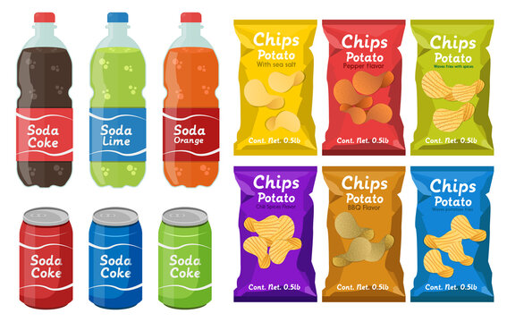
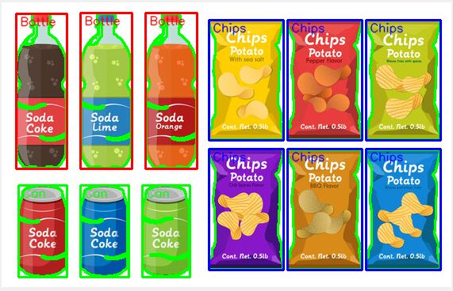

# Segment Similar Objects From Image

This project is a Python-based image processing application that detects items such as "Chips," "Can," and "Bottle" using template matching and contour detection. 
The project integrates **PyQt5** for the GUI and **OpenCV** for the image processing.

## Features

- Load and process images using a simple GUI.
- Detect items based on preloaded Chips, Can, and Bottle templates.
- Apply contour detection and draw bounding boxes around detected items.
- Display the processed image and contours, highlighting detected items in different colors.

## How It Works

1. **Image Loading**: Users can load an image from their system.
2. **Preprocessing**: The image is converted to grayscale and thresholded to create a binary image.
3. **Contour Detection**: Contours are detected in the binary image.
4. **Template Matching**: Detected regions of interest (ROI) are compared against preloaded templates using SIFT feature matching.
5. **Result Display**: The detected items are highlighted with bounding boxes, and their names are labeled on the image.

## Screenshots

### Input Image


### Grayscale and Binary Processing


### Contour Detection


### Final Output with Detected Items



## Prerequisites

Before running the application, make sure you have the following installed:

- Python 3.x (spyder IDE I prefer)
- [PyQt5](https://pypi.org/project/PyQt5/)
- [OpenCV](https://pypi.org/project/opencv-python/)
- NumPy


To install the required packages, run:

```bash
pip install PyQt5 opencv-python opencv-contrib-python numpy
